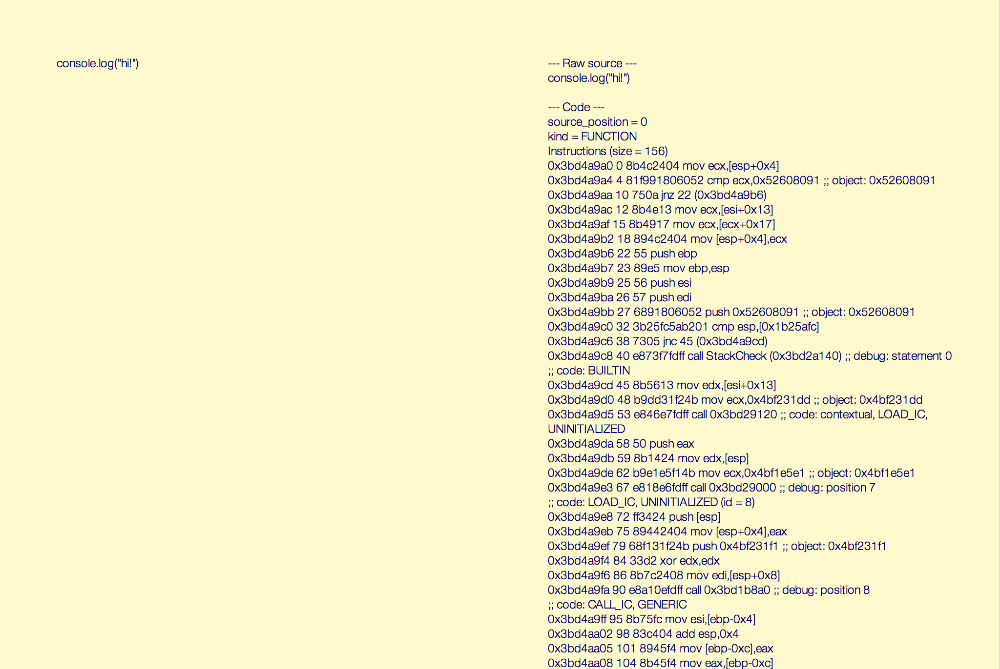

# v8-live



This is an experimental web app which lets you enter JavaScript code and then see the resulting v8 generated machine code in real time.

## setup

```bash
$ npm install # grab dependencies
$ webpack && node app.js # build the client bundle, and run the server
```

Visit `localhost:3000` to test it out.
